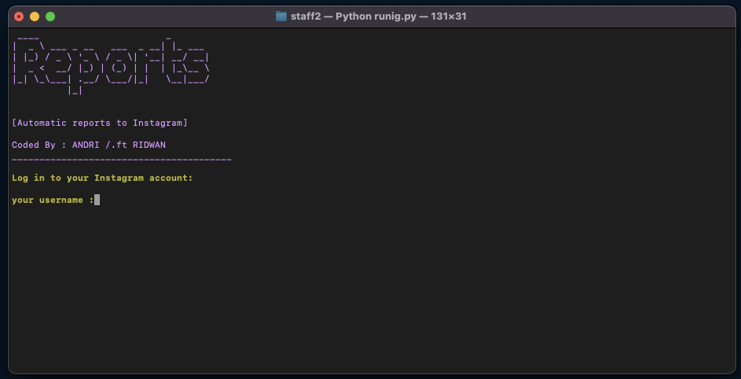
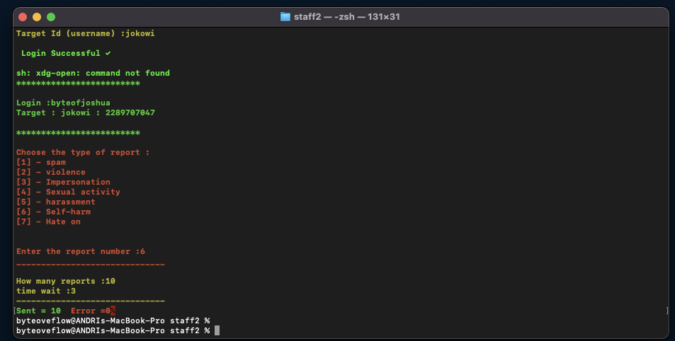

# Instaports 
Instagram Automatic tools for reporting users ``Instagram_api`` Private Project 2022     
  
## Running Automatic Reports Tool  
Saya membuat software tersebut bukan untuk dipergunakan untuk hal-hal yang bersifat ilegal ataupun menentang pasal-pasal
saya membuat tools ini untuk suatu project yang akan datang dan dapat digunakan untuk kepemerintahan.  
 
        
   
## Installation    
   
1) git clone https://github.com/byteofandri/instaports.git
2) cd instaports
3) python3 instaports.py  

   

## Config Files
File konfigurasi adalah file python yang ada di direktori ./attack penyelundup. File-file ini menjelaskan konten permintaan HTTP dan mutasi pengkodean transfer yang akan diuji.


Berikut adalah contoh konten default.py:
```python
page_headers = {
    "Accept": "text/html,application/xhtml+xml,application/xml;q=0.9,image/webp,*/*;q=0.8",
    "Accept-Encoding": "gzip, deflate",
    "Accept-Language": "tr-TR,tr;q=0.8,en-US;q=0.5,en;q=0.3",
    "Cache-Control": "no-cache",
    "Connection": "keep-alive",
    "DNT": "1", 
}  

report_headers = {
    "Accept": "*/*",
    "Accept-Encoding": "gzip, deflate",
    "Accept-Language": "tr-TR,tr;q=0.8,en-US;q=0.5,en;q=0.3",
    "Cache-Control": "no-cache",
    "Connection": "keep-alive",
    "Content-Type": "application/x-www-form-urlencoded",
    "DNT": "1", 
    "Host": "help.instagram.com",
    "Origin": "help.instagram.com", 
    "Pragma": "no-cache",
    "Referer": "https://help.instagram.com/contact/497253480400030",
    "TE": "Trailers",
}

def random_str(length):
    letters = string.ascii_lowercase + string.ascii_uppercase + string.digits
    return ''.join(random.choice(letters) for i in range(length))

def report_profile_attack(username, proxy):
    ses = Session()
    
  try:
        res = ses.post(
            "https://help.instagram.com/ajax/help/contact/submit/page",
            data=report_form,
            headers=report_headers,
            cookies=report_cookies,
            timeout=10
        )
    except:
        print_error("Connection error occurred! (FormRequestsError)")
        return
    
    if (res.status_code != 200):
        print_error("Connection error occurred! (STATUS CODE:", res.status_code, ")")
        return
    
    print_success("Successfully reported!") 
```
Belum ada argumen masukan untuk menentukan header pelanggan dan agen pengguna Anda sendiri. Disarankan untuk membuat file konfigurasi Anda sendiri berdasarkan configuration.py dan memodifikasinya sesuai keinginan Anda.

Informasi terkait checkpoint dikarenakan anda menggunakan proxy, solusi dari masalah tersebut gunakan banyak akun polosan dan gabungkan menjadi ``/wordlist.txt`` dijalankan bersamaan dengan ``proxy.list`` agar tidak terkena checkpoint secara bersamaan.
  
tentukan file konfigurasi menggunakan opsi baris perintah ``/attack.py`` 
 
